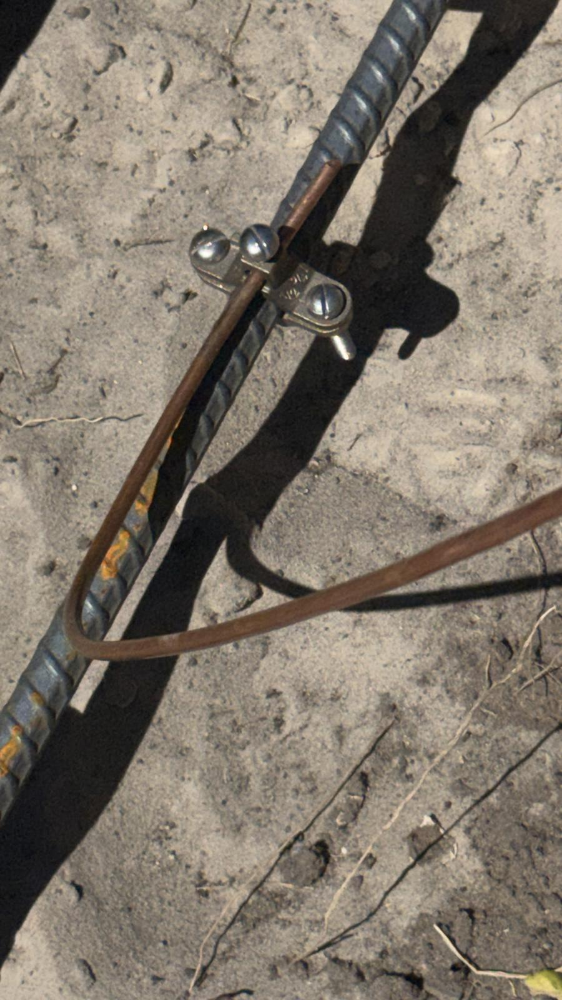

# Protocol 200: Footer Bond Inspection — Concrete-Encased Grounding Electrode (Ufer Ground)

> **Inspection Type:** Electrical / Structural — Foundation Grounding
> **Version:** 1.0
> **Jurisdiction Basis:** Florida Building Code (FBC), 8th Edition — Electrical Volume (NEC as adopted); NEC 2023, Article 250
> **Author/Reviewer PE:** [Oasis Engineering]
> **Revision Date:** 2026-03-24

---



## 1) Scope

Pre-pour verification of the concrete-encased grounding electrode (commonly called a "Ufer ground") installed in the residential footing. This protocol covers the inspection window **after the grounding electrode conductor (GEC) is connected to the footer reinforcement but before concrete placement**, ensuring the electrical bonding is code-compliant and will be permanently encased correctly.

This inspection is typically performed at the same site visit as the footer structural inspection (Protocol 101) since both must be verified before the pour.

### In Scope
- Grounding electrode conductor (GEC) material, size, and routing.
- Connection method between GEC and footing rebar (clamp type, exothermic weld, etc.).
- Rebar electrode length and continuity (minimum 20 ft).
- Concrete encasement requirements (minimum 2 in. cover around electrode).
- GEC protection where it exits the concrete.
- Connection accessibility and documentation.

### Out of Scope
- Footing structural inspection (see [Protocol 101](../STRUCTURAL/101_footer_inspection.md)).
- Main electrical panel grounding and bonding (separate inspection).
- Supplemental grounding electrodes (ground rods, water pipe bonds).
- Lightning protection systems.

---

## 2) Objective

Determine whether the concrete-encased grounding electrode installation is ready to be permanently encased by verifying:
- **PASS:** GEC size, connection method, electrode rebar length, and routing all meet NEC Article 250 and FBC requirements.
- **HOLD:** Minor corrections needed before pour authorization (e.g., clamp not fully tightened, GEC routing needs adjustment).
- **FAIL / STOP WORK:** Non-listed clamp, undersized GEC, insufficient electrode length, or missing installation entirely.

---

## 3) Code & Standard Basis

### Required (Code)
| Reference | Section | Requirement |
|---|---|---|
| NEC 2023 | 250.52(A)(3) | Concrete-encased electrode — minimum 20 ft of ½ in. rebar encased in min. 2 in. of concrete, in direct contact with earth |
| NEC 2023 | 250.66(B) | GEC to concrete-encased electrode need not be larger than #4 AWG copper |
| NEC 2023 | 250.70 | Connection methods — must use listed clamps, listed pressure connectors, exothermic welding, or other listed means |
| NEC 2023 | 250.64(A) | GEC material — copper, aluminum, or copper-clad aluminum |
| NEC 2023 | 250.64(B) | GEC protection — where exposed to physical damage, must be protected in rigid metal conduit, IMC, PVC, or other listed means |
| NEC 2023 | 250.64(C) | GEC must be continuous — no splices except by irreversible compression connectors or exothermic welding |
| FBC — Electrical | As adopted | Florida adopts NEC with state amendments; concrete-encased electrodes are standard practice due to Florida's high-resistivity sandy soils |

### Guidance (Standards)
| Reference | Use |
|---|---|
| UL 467 | Standard for grounding and bonding equipment — clamp listing requirements |
| IEEE 142 (Green Book) | Grounding of industrial and commercial power systems — background theory |
| NFPA 70 Commentary | Practical explanations of NEC grounding provisions |

---

## 4) Tools Required

| Tool | Minimum Spec | Notes |
|---|---|---|
| Tape measure | 25 ft, 1/16 in. graduations | Measure rebar electrode length and GEC routing |
| Wire gauge / caliper | AWG capable | Verify GEC conductor size (#4 AWG copper) |
| Rebar gauge | Reads bar markings | Confirm ½ in. minimum rebar at electrode |
| Camera with timestamp | Date/time/GPS | All photos must include scale reference |
| Flashlight | High-lumen | Inspect clamp connections in trench |
| Approved plans (sealed set) | Current revision | Electrical grounding plan and foundation plan |
| Field notebook / inspection form | — | Record all measurements and clamp markings |

---

## 5) Safety + Non-Destructive Limits

- **Trench safety:** Do not enter excavations deeper than 4 ft without shoring or sloping per OSHA 29 CFR 1926 Subpart P. Inspect from the edge where possible.
- **Do not** disturb or tug on the GEC or connection to "test" it — visual and measurement-based verification only.
- **Do not** energize any circuit to test the grounding electrode before encasement.
- **Stop condition:** If the GEC is not present or the connection is missing entirely, STOP and notify the electrical contractor before the pour. Once the concrete is placed, this electrode is permanent and inaccessible.

---

## 6) Preconditions

- [ ] Footer excavation is complete and rebar is placed (Protocol 101 may be concurrent).
- [ ] Electrical contractor has installed the GEC and made the connection to the footing rebar.
- [ ] Approved electrical plans and foundation plans are on-site.
- [ ] Concrete has NOT been placed — the connection must be visible and accessible.
- [ ] The GEC routing from the footing to the eventual panel location is roughed in or planned.

---

## 7) Procedure Steps

### Step 1: Identify the Grounding Electrode Rebar

1. Locate the specific rebar designated as the concrete-encased electrode.
   - This may be one of the continuous longitudinal bars in the footing, or a dedicated bar placed for this purpose.
2. Verify the rebar is **minimum ½ in. diameter** (#4 rebar = ½ in.).
   - Check bar markings or measure with calipers.
3. Verify the rebar provides a **minimum 20 ft of continuous length** within the footing:
   - Measure or trace the bar from end to end.
   - If the 20 ft is achieved across multiple pieces, verify the pieces are connected by **steel tie wires, welding, or other effective means** per NEC 250.52(A)(3).
   - A single continuous bar is preferred.
4. Confirm the electrode rebar is located **within the portion of the footing that will be in direct contact with earth**:
   - The rebar must be horizontally encased in the footing, not in an above-grade stem wall or non-earth-contact element.

### Step 2: Verify the Grounding Electrode Conductor (GEC)

1. Identify the GEC conductor running from the footing connection to the future panel location.
2. Verify **conductor material**: must be copper (most common), aluminum, or copper-clad aluminum per NEC 250.64(A).
3. Verify **conductor size**: minimum **#4 AWG copper** for connection to a concrete-encased electrode per NEC 250.66(B).
   - Read the conductor markings or measure gauge.
   - #4 AWG copper is approximately 0.204 in. (5.19 mm) diameter for solid conductor.
4. Verify the GEC is **continuous** from the electrode connection to the panel location:
   - No splices are permitted unless made by irreversible compression connectors or exothermic welding (NEC 250.64(C)).
   - Wire nuts, bolt clamps, or other reversible splices in the GEC run are a code violation.

### Step 3: Inspect the Connection (GEC to Rebar)

**This is the most critical checkpoint of this inspection.**

1. Identify the connection method used to attach the GEC to the footing rebar.
2. Verify the connection uses one of the following **approved methods per NEC 250.70**:

   | Approved Method | What to Look For |
   |---|---|
   | **Exothermic weld (Cadweld)** | Permanent fused connection — copper slug visible, irreversible. Preferred method. |
   | **Listed grounding clamp** | Must bear a **UL listing mark** and be rated for: (a) the conductor material, (b) the electrode material, (c) direct burial / concrete encasement. Look for manufacturer markings and UL stamp. |
   | **Listed pressure connector** | Bolted or compression fitting with UL listing for grounding and bonding. |

3. **RED FLAG — Non-listed clamps:**
   - **Wire rope clamps (U-bolt cable clamps)** purchased from a hardware store are **NOT listed grounding clamps** per UL 467. These are designed for wire rope/cable rigging, not electrical bonding.
   - **Hose clamps, pipe clamps, or generic bolted clamps** without a UL listing for grounding are not acceptable.
   - If a non-listed clamp is found, this is an **automatic FAIL**. The clamp must be replaced with a listed grounding clamp or an exothermic weld before the pour.

4. Verify the clamp or connection is **tight and secure**:
   - No looseness, no visible gaps between the conductor and the rebar.
   - Clamp bolts fully tightened.
   - Conductor not kinked, nicked, or damaged at the connection point.

5. Verify only **one conductor per clamp** unless the clamp is specifically listed for multiple conductors.

### Step 4: Verify Concrete Encasement Will Be Adequate

1. Confirm the electrode rebar will have a **minimum 2 inches of concrete cover** on all sides when the footing is poured:
   - Check rebar position relative to the trench walls and bottom.
   - For earth-formed footings, the structural 3 in. cover requirement (ACI 318) will satisfy the 2 in. NEC requirement.
2. Confirm the GEC connection point will be fully encased in concrete:
   - The connection (clamp or weld) should be located within the footing pour area, not at the edge where it could be exposed.

### Step 5: Verify GEC Protection and Routing

1. Trace the GEC from the footing connection to where it exits the concrete/ground:
   - Where the GEC exits the concrete or is exposed to **physical damage**, it must be protected in conduit per NEC 250.64(B):
     - Rigid metal conduit (RMC)
     - Intermediate metal conduit (IMC)
     - Rigid PVC conduit
     - Electrical metallic tubing (EMT)
     - Or other listed protection method.
2. Verify the GEC is routed to avoid damage during the concrete pour and subsequent construction:
   - Not routed through areas where it will be cut, crushed, or disturbed by future work.
   - Secured to prevent displacement during the pour.
3. Confirm the GEC has a clear, planned path to the electrical panel location.

### Step 6: Verify Electrode System Completeness

1. Check the electrical plans for any **additional grounding electrode requirements**:
   - NEC 250.53(D)(2) requires a supplemental electrode (typically a ground rod) when using a concrete-encased electrode unless the concrete-encased electrode meets the resistance requirements.
   - In Florida, the concrete-encased electrode is typically the primary electrode, often supplemented by ground rods.
2. Confirm that the concrete-encased electrode is identified on the plans and the inspector can verify it matches the installation.

### Step 7: Final Documentation

1. Photograph the connection from multiple angles:
   - Wide shot showing the GEC entering the footing area.
   - Close-up of the connection (clamp/weld) to rebar with clamp markings visible.
   - Close-up of the GEC conductor with gauge markings visible.
   - GEC routing and protection where it exits the footing area.
2. Record:
   - Clamp manufacturer and model (or note "exothermic weld").
   - GEC conductor size and material.
   - Electrode rebar size and estimated length in footing.
   - Connection location within the footing.
3. Note the connection location on the foundation plan for future reference.

---

## 8) Interpretation Criteria

| Result | Condition |
|---|---|
| **PASS** | GEC is #4 AWG copper minimum, connected to ½ in. minimum rebar with 20 ft in footing, using a listed clamp or exothermic weld, properly routed and protected, connection tight and secure |
| **HOLD** | Listed clamp present but not fully tightened, GEC routing needs minor adjustment before pour, protection conduit not yet installed but materials are on-site |
| **FAIL** | Non-listed clamp (wire rope clamp, hose clamp, etc.), GEC undersized (smaller than #4 AWG), electrode rebar less than 20 ft, GEC spliced with non-approved method, connection missing entirely |

---

## 9) What AI Gets Wrong

1. **Confuses structural rebar inspection with electrical bonding inspection.** LLMs frequently merge the footer structural inspection with the grounding electrode verification into a single protocol. These are two separate inspections with different code bases (ACI 318 vs. NEC 250) and different failure criteria. A footing can pass structurally and fail the bonding inspection, or vice versa.

2. **Treats any clamp on rebar as an approved grounding connection.** AI does not distinguish between a UL-listed grounding clamp and a hardware-store wire rope clamp. The visual difference is subtle — both are metal clamps with bolts — but only clamps listed per UL 467 and bearing the UL mark are code-compliant for NEC 250.70.

3. **Gets the GEC size wrong.** AI often cites Table 250.66 for GEC sizing, which can call for much larger conductors based on the service size. However, NEC 250.66(B) provides a specific exception: the GEC to a concrete-encased electrode **need not be larger than #4 AWG copper**, regardless of the service size. This is frequently missed.

4. **Ignores the 20-foot minimum length requirement.** LLMs often state that "the rebar in the footing" serves as the electrode without specifying the 20 ft minimum continuous length. A short footing run or a footing with multiple discontinuous short bars may not meet this requirement.

5. **Skips GEC protection requirements.** AI-generated checklists rarely mention NEC 250.64(B) requiring physical protection of the GEC where exposed to damage. The transition from concrete to open air is a common point of vulnerability that needs conduit protection.

---

## 10) Documentation Minimum

- [ ] Project address, permit number, date, time, weather conditions.
- [ ] Name and PE / inspector license number.
- [ ] Plan sheet reference (electrical grounding plan and foundation plan, revisions and dates).
- [ ] Electrode rebar size and estimated continuous length in footing.
- [ ] GEC conductor material and size (AWG).
- [ ] Connection method (exothermic weld / listed clamp — manufacturer and model).
- [ ] UL listing verification on clamp (if clamp method used).
- [ ] Connection tightness and condition.
- [ ] GEC routing description (from footing to panel path).
- [ ] GEC protection method where exposed to physical damage.
- [ ] Photo set with scale reference (minimum 6 photos per inspection).
- [ ] Deficiency list (if any) with required corrective actions.
- [ ] Final disposition: PASS / HOLD / FAIL with signature.
- [ ] Limitations statement: "This inspection is limited to visual observation of accessible conditions at the time of inspection. Concealed conditions after concrete placement are excluded. Electrode resistance testing, if required, is a separate scope."

---

## 11) Escalation Path

| Trigger | Action |
|---|---|
| Non-listed clamp found (wire rope clamp, hose clamp, etc.) | Fail → electrical contractor must replace with listed clamp or exothermic weld before pour |
| GEC smaller than #4 AWG copper | Fail → replace conductor before pour |
| Electrode rebar less than 20 ft continuous | Fail → extend rebar or install additional electrode per NEC |
| GEC spliced with unapproved method (wire nuts, etc.) | Fail → replace with continuous conductor or use irreversible compression/exothermic splice |
| No GEC or connection present at footing | Stop work → electrical contractor must install before pour — cannot be remedied after concrete placement |
| Connection location will not have 2 in. concrete cover | Hold → reposition connection within footing before pour |
| GEC exposed to damage without protection | Hold → install conduit protection before backfill/construction proceeds |

---

## Field Photo Checklist

Use this shot list for consistent documentation:

1. **Wide shot** — footing with GEC entering the trench area, showing context.
2. **GEC conductor** — close-up showing the copper conductor with gauge markings if visible.
3. **Connection close-up** — clamp or exothermic weld on the rebar, showing clamp markings/UL listing.
4. **Connection from second angle** — show both the rebar and conductor engagement.
5. **Clamp markings** — if a clamp is used, photograph manufacturer name and any listing marks.
6. **GEC routing** — show the path from the connection to where it exits the footing area.
7. **GEC protection** — conduit or protection at the concrete/air transition.
8. **Electrode rebar** — show the rebar that serves as the electrode within the footing.
9. **Any deficiencies** — close-up of non-listed clamps, undersized conductor, etc.
10. **Overview with context** — property, permit board, or address marker in frame.

---

## Why This Matters in Florida

Florida's sandy, often dry soils have **high electrical resistivity**, which makes achieving a low-impedance grounding electrode difficult with ground rods alone. The concrete-encased electrode (Ufer ground) is particularly effective because the concrete in direct contact with earth absorbs and retains moisture, dramatically lowering the resistance of the electrode compared to a ground rod driven into dry sand.

This is why the concrete-encased electrode is essentially **standard practice** on Florida residential construction — and why getting the connection right before the pour is critical. Once the concrete is placed, this electrode and its connection are permanent and inaccessible. A failed connection means the house's primary grounding electrode may be ineffective, with no practical way to repair it without supplemental electrodes.

---

## Quick Reference: Approved vs. Not Approved Connections

```
✅ APPROVED (NEC 250.70)              ❌ NOT APPROVED
─────────────────────────────         ─────────────────────────────
Exothermic weld (Cadweld)            Wire rope clamp (U-bolt cable clamp)
Listed grounding clamp (UL 467)      Hose clamp
Listed pressure connector            Pipe clamp
Listed lug                           Generic bolted clamp (no UL mark)
                                     Wire nut or twist-on connector
                                     Duct tape / electrical tape wrap
```
